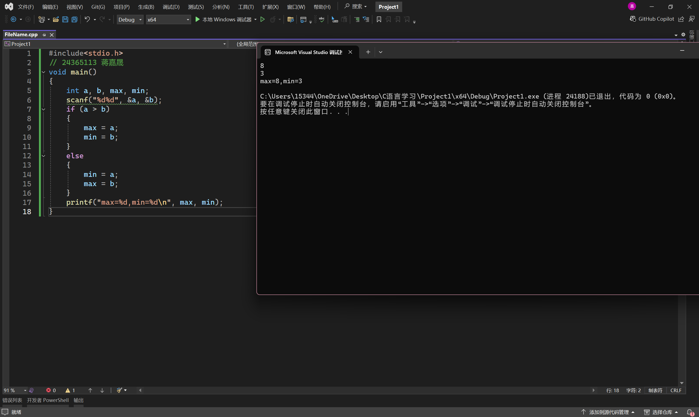
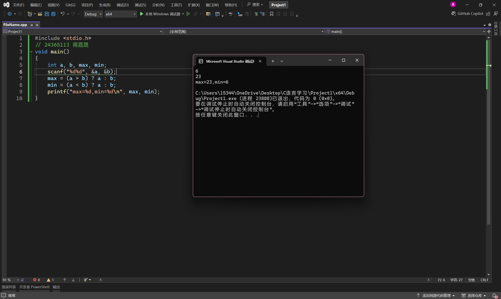
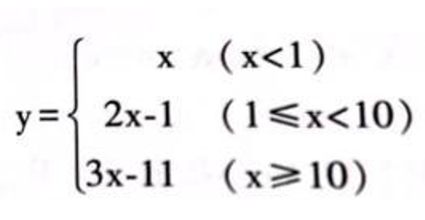
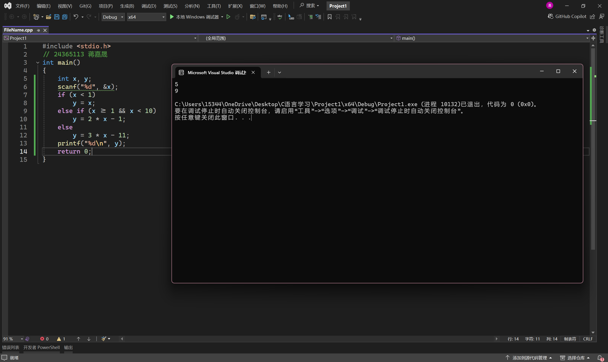
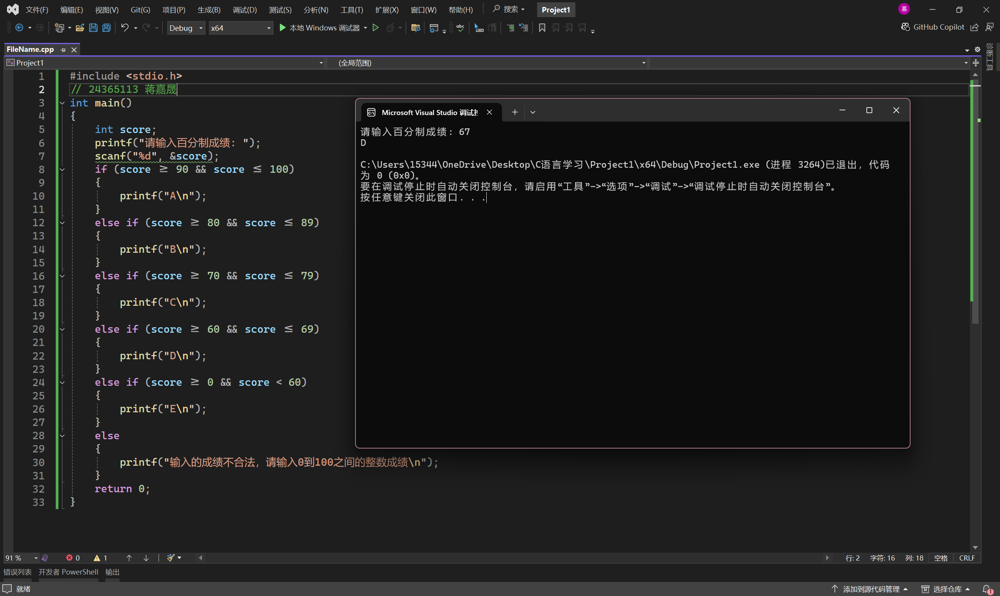
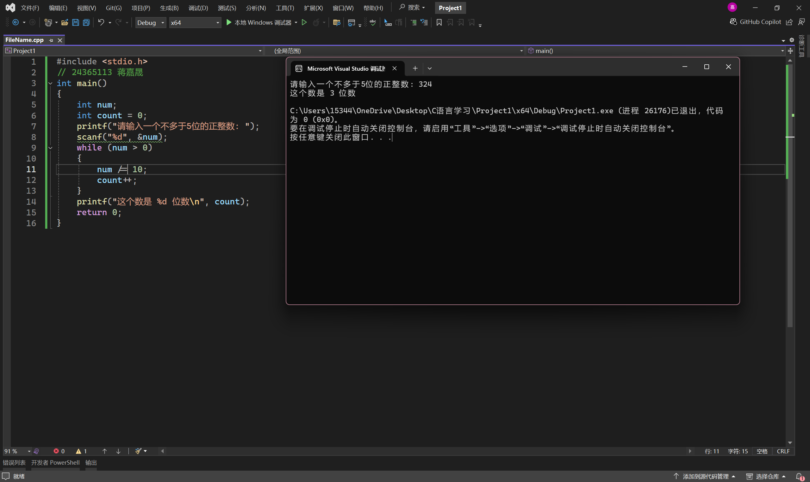
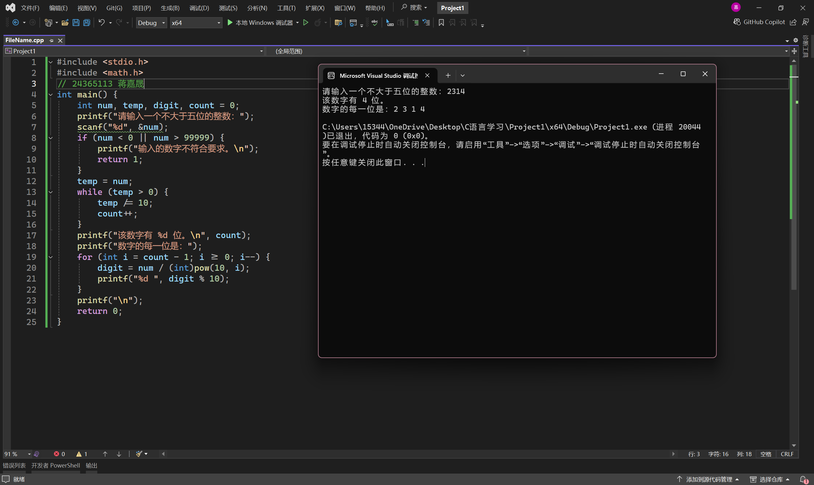
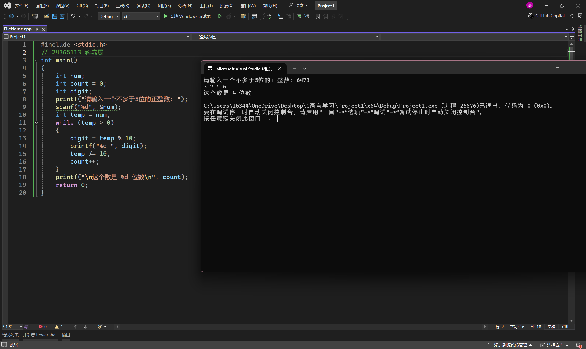
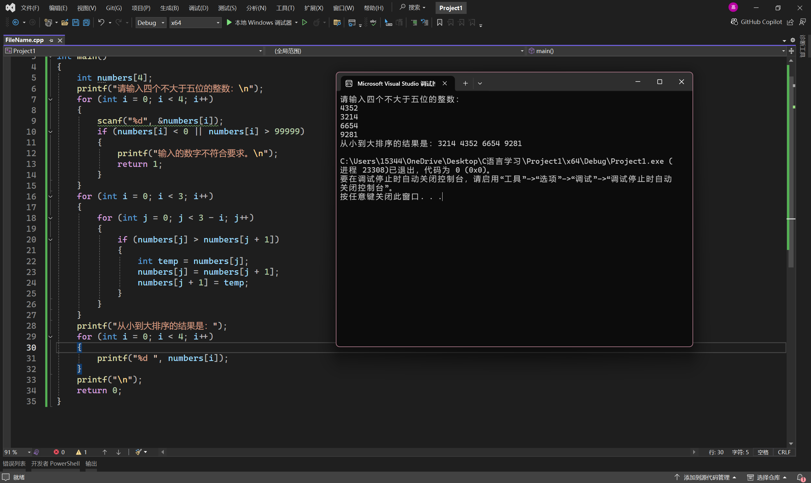

# 实验三 分支结构程序设计


## 一、实验目的
1. 了解c语言表示逻辑量的方法（以0代表“假”，以1代表“真”）。
2. 学会正确使用逻辑运算符和逻辑表达式。
3. 熟练掌握if语句和switch语句。

## 二、实验准备
1. 复习关系、逻辑、条件运算符和表达式。
2. 复习if语句的三种形式。
3. 复习if语句的嵌套并能正确分析。
4. 复习多分支选择switch语句。

## 三、实验内容
1.调试下列程序

```
#include<stdio.h>
void main ()
{
	int a,b,max,min;
	scanf("%d%d",&a,&b);
	if(a>b)
	{
		max=a;
		min=b;
	}
	else
	{
		min=a;
		max=b;
	}
	printf("max=%d,min=%d\n",max,min);
}
```



问题：
此程序的功能是什么？

答：比较两数大小并输出。
请用条件表达语句（？：）修改程序使之完成相同的功能。



2.编程
（a）有一函数



用scanf函数输入x的值（分别为x<1、1<=x<10、x>=10三种情况），求y值。



（b）给出一个百分制成绩，要求输出成绩等级'A''B''C''D''E'。（90分以上为'A',80~89分为'B',70~79分为'C',60~69分为'D',60分以下为'E'。）



（c）有一个不多于5位的正整数，要求：
求出它是几位数。



分别打印出每一位数字。



按逆序打印出各位数字，例如原数为321，应输出123。



输出四个整数，要求按大小顺序输出。




